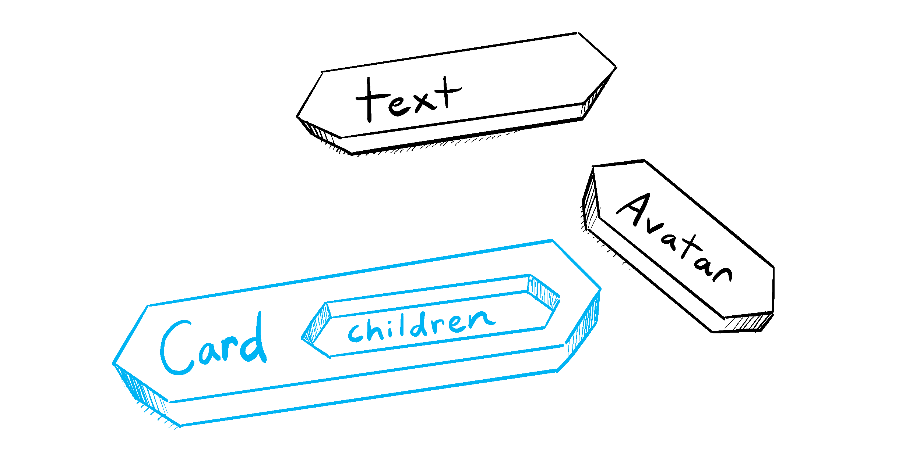
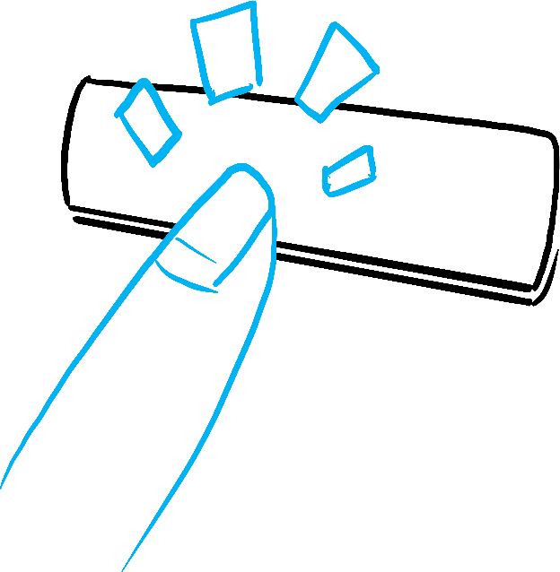
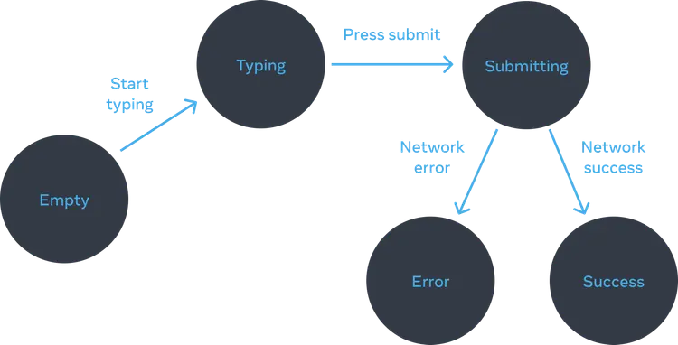

# React

- [React](#react)
  - [React components](#react-components)
    - [Step 1: Export the component](#step-1-export-the-component)
    - [Step 2: Define the function](#step-2-define-the-function)
    - [Step 3: Add markup](#step-3-add-markup)
    - [Using a component](#using-a-component)
    - [What the browser sees](#what-the-browser-sees)
    - [Nesting and organising components](#nesting-and-organising-components)
  - [Importing and exporting components](#importing-and-exporting-components)
    - [Default vs named exports](#default-vs-named-exports)
    - [Mixing default and named exports](#mixing-default-and-named-exports)
  - [Recap](#recap)
  - [The Rules of JSX](#the-rules-of-jsx)
    - [1. Return a single root element](#1-return-a-single-root-element)
    - [2. Close all the tags](#2-close-all-the-tags)
    - [3. camelCase ~~all~~ most of the things!](#3-camelcase-all-most-of-the-things)
    - [Pro-tips](#pro-tips)
    - [JavaScript in JSX with curly braces](#javascript-in-jsx-with-curly-braces)
      - [Using double curlies](#using-double-curlies)
      - [Recap](#recap-1)
  - [Props](#props)
    - [Familiar props](#familiar-props)
    - [Step 1: Pass props to the child component](#step-1-pass-props-to-the-child-component)
    - [Step 2: Read props inside the child component](#step-2-read-props-inside-the-child-component)
    - [Default values](#default-values)
    - [Forwarding props](#forwarding-props)
    - [Passing JSX as children](#passing-jsx-as-children)
    - [How props change over time](#how-props-change-over-time)
    - [Recap](#recap-2)
  - [Managing state](#managing-state)
    - [Thinking about UI declaratively](#thinking-about-ui-declaratively)
      - [Step 1: Identify your component’s different visual states](#step-1-identify-your-components-different-visual-states)
        - [Displaying many visual states at once](#displaying-many-visual-states-at-once)
      - [Step 2: Determine what triggers those state changes](#step-2-determine-what-triggers-those-state-changes)
      - [Step 3: Represent the state in memory with useState](#step-3-represent-the-state-in-memory-with-usestate)
      - [Step 4: Remove any non-essential state variables](#step-4-remove-any-non-essential-state-variables)
      - [Step 5: Connect the event handlers to set state](#step-5-connect-the-event-handlers-to-set-state)
    - [Recap](#recap-3)

## React components

A component in React is a reusable piece of code that represents a part of the user interface. Components can be thought of as custom HTML elements that you can create and use in your React applications.

```jsx
export default function Profile() {
  return ;
}
```

### Step 1: Export the component

The export default prefix is a standard JavaScript syntax (not specific to React). It lets you mark the main function in a file so that you can later import it from other files. (More on importing in Importing and Exporting Components!)

### Step 2: Define the function

With function Profile() { } you define a JavaScript function with the name Profile.

> [!WARNING]
> React components are regular **JavaScript functions**, but their names **must start with a capital letter** or they won’t work!

### Step 3: Add markup

Return statements can be written all on one line, as in this component:

```jsx
return ;
```

But if your markup isn’t all on the same line as the return keyword, you must wrap it in a pair of parentheses:

```jsx
return (
  <div>
    
  </div>
);
```

### Using a component

Now that you’ve defined your Profile component, you can nest it inside other components. For example, you can export a Gallery component that uses multiple Profile components:

```jsx
function Profile() {
  return ;
}

export default function Gallery() {
  return (
    <section>
      <h1>Amazing scientists</h1>
      <Profile />
      <Profile />
      <Profile />
    </section>
  );
}
```

### What the browser sees

Notice the difference in casing:

- `<section>` is lowercase, so React knows we refer to an HTML tag.
- `<Profile />` starts with a capital `P`, so React knows that we want to use our component called Profile.

And `Profile` contains even more HTML: ``. In the end, this is what the browser sees:

```html
<section>
  <h1>Amazing scientists</h1>
  
  
  
</section>
```

### Nesting and organising components

Because the `Profile` components are rendered inside `Gallery`—even several times!—we can say that `Gallery` is a **parent component**, rendering each `Profile` as a “child”. This is part of the magic of React: you can define a component once, and then use it in as many places and as many times as you like.

Components can render other components, but **you must never nest their definitions**:

```jsx
export default function Gallery() {
  // 🔴 Never define a component inside another component!
  function Profile() {
    // ...
  }
  // ...
}
```

The snippet above is very slow and causes bugs. Instead, define every component at the top level:

```jsx
export default function Gallery() {
  // ...
}

// ✅ Declare components at the top level
function Profile() {
  // ...
}
```

When a child component needs some data from a parent, pass it by props instead of nesting definitions.

## Importing and exporting components

### Default vs named exports

There are two primary ways to export values with JavaScript: default exports and named exports. So far, our examples have only used default exports. But you can use one or both of them in the same file. A file can have no more than one default export, but it can have as many named exports as you like.

How you export your component dictates how you must import it. You will get an error if you try to import a default export the same way you would a named export! This chart can help you keep track:

| Syntax  | Export statement                      | Import statement                        |
| ------- | ------------------------------------- | --------------------------------------- |
| Default | `export default function Button() {}` | `import Button from './Button.js';`     |
| Named   | `export function Button() {}`         | `import { Button } from './Button.js';` |

When you write a _default_ import, you can put any name you want after `import`. For example, you could write `import Banana from './Button.js'` instead and it would still provide you with the same default export. In contrast, with named imports, the name has to match on both sides. That’s why they are called named imports!

### Mixing default and named exports

> [!TIP]
> To reduce the potential confusion between default and named exports, some teams choose to only stick to one style (default or named), or avoid mixing them in a single file. Do what works best for you!

**People often use default exports if the file exports only one component, and use named exports if it exports multiple components and values**. Regardless of which coding style you prefer, always give meaningful names to your component functions and the files that contain them. Components without names, like export default () => {}, are discouraged because they make debugging harder.

```jsx
import Gallery from "./Gallery.js"; // Default import
import { Profile } from "./Gallery.js"; // Named import

export default function App() {
  return <Profile />;
}
```

```jsx
// Named export
export function Profile() {
  return ;
}

// Default export
export default function Gallery() {
  return (
    <section>
      <h1>Amazing scientists</h1>
      <Profile />
      <Profile />
      <Profile />
    </section>
  );
}
```

- `Gallery.js`:
  - Exports the `Profile` component as a **named export called `Profile`**.
  - Exports the `Gallery` component as a **default export**.
- `App.js`:
  - Imports `Profile` as a **named import called `Profile`** from `Gallery.js`.
  - Imports `Gallery` as a **default import** from `Gallery.js`.
  - Exports the root `App` component as a **default export**.

## Recap

You’ve just gotten your first taste of React! Let’s recap some key points.

- React lets you create components, **reusable UI elements** for your app.
- In a React app, every piece of UI is a component.
- React components are regular JavaScript functions except:
  1. Their names always begin with a capital letter.
  1. They return JSX markup.

## The Rules of JSX

### 1. Return a single root element

To return multiple elements from a component, wrap them with a single parent tag.

For example, you can use a `<div>`:

```jsx
<div>
  <h1>Hedy Lamarr's Todos</h1>
  
  <ul>
    ...
  </ul>
</div>
```

If you don’t want to add an extra `<div>` to your markup, you can write `<>` and `</>` instead:

```jsx
<>
  <h1>Hedy Lamarr's Todos</h1>
  
  <ul>
    ...
  </ul>
</>
```

This empty tag is called a _Fragment_. Fragments let you group things without leaving any trace in the browser HTML tree.

> [!NOTE]
> JSX looks like HTML, but under the hood it is transformed into plain JavaScript objects. You can’t return two objects from a function without wrapping them into an array. This explains why you also can’t return two JSX tags without wrapping them into another tag or a Fragment.

### 2. Close all the tags

JSX requires tags to be explicitly closed: self-closing tags like `` must become ``, and wrapping tags like `<li>oranges` must be written as `<li>oranges</li>`.

### 3. camelCase ~~all~~ most of the things!

JSX turns into JavaScript and attributes written in JSX become keys of JavaScript objects. In your own components, you will often want to read those attributes into variables. But JavaScript has limitations on variable names. For example, their names can’t contain dashes or be reserved words like `class`.

This is why, in React, many HTML and SVG attributes are written in camelCase. For example, instead of `stroke-width` you use `strokeWidth`. Since `class` is a reserved word, in React you write `className` instead, named after the [corresponding DOM property](https://developer.mozilla.org/en-US/docs/Web/API/Element/className).

### Pro-tips

- In JSX, you can use JavaScript expressions inside curly braces `{}`. For example, to dynamically set an image's `src` attribute, you can do:

  ```jsx
  const imageUrl = "https://i.imgur.com/MK3eW3As.jpg";
  return ;
  ```

- Comments in JSX are written inside curly braces using JavaScript comment syntax:

  ```jsx
  return (
    <div>
      {/* This is a comment in JSX */}
      <h1>Hello, World!</h1>
    </div>
  );
  ```

- To conditionally render elements in JSX, you can use JavaScript logical operators. For example:

  ```jsx
  const isLoggedIn = true;
  return <div>{isLoggedIn && <h1>Welcome back!</h1>}</div>;
  ```

- Use a JSX [Converter tool](https://transform.tools/html-to-jsx) to help you convert HTML code snippets into JSX format quickly.

### JavaScript in JSX with curly braces

You can embed any JavaScript expression in JSX by wrapping it in curly braces `{}`. This allows you to dynamically set attributes, render values, and include logic directly within your JSX markup.

```jsx
function Greeting({ name }) {
  return <h1>Hello, {name}!</h1>;
}
```

#### Using double curlies

When you need to pass an object or an array as a prop, you can use double curly braces. The outer curly braces indicate that you're embedding a JavaScript expression, while the inner curly braces represent the object or array itself.

```jsx
function Box() {
  const boxStyle = {
    width: "100px",
    height: "100px",
    backgroundColor: "blue",
  };

  return <div style={boxStyle}></div>;
}
```

```jsx
const person = {
  name: "Gregorio Y. Zara",
  theme: {
    backgroundColor: "violet",
    color: "pink",
  },
};

export default function TodoList() {
  return (
    <div style={person.theme}>
      <h1>{person.name}'s Todos</h1>
      
      <ul>
        <li>Improve the videophone</li>
        <li>Prepare aeronautics lectures</li>
        <li>Work on the alcohol-fuelled engine</li>
      </ul>
    </div>
  );
}
```

> [!WARNING]
> Inline `style` properties are written in camelCase. For example, HTML `<ul style="background-color: black">` would be written as `<ul style={{ backgroundColor: 'black' }}> ` in your component.

#### Recap

- JSX attributes inside quotes are passed as strings.
- Curly braces let you bring JavaScript logic and variables into your markup.
- They work inside the JSX tag content or immediately after `=` in attributes.
- `{{` and `}}` is not special syntax: it’s a JavaScript object tucked inside JSX curly braces.

## Props

React components can accept inputs called "props" (short for properties) and manage internal data using "state". Props are passed to components (children) from their parent, while state is managed within the component itself.

### Familiar props

Props are the information that you pass to a JSX tag. For example, `className`, `src`, `alt`, `width`, and `height` are some of the props you can pass to an ``:

```jsx
function Avatar() {
  return (
    
  );
}

export default function Profile() {
  return <Avatar />;
}
```

### Step 1: Pass props to the child component

First, pass some props to `Avatar`. For example, let’s pass two props: `person` (an object), and `size` (a number):

```jsx
export default function Profile() {
  return (
    <Avatar person={{ name: "Lin Lanying", imageId: "1bX5QH6" }} size={100} />
  );
}
```

> [!NOTE]
> If double curly braces after `person=` confuse you, recall they’re [merely an object](https://react.dev/learn/javascript-in-jsx-with-curly-braces#using-double-curlies-css-and-other-objects-in-jsx) inside the JSX curlies.

Now you can read these props inside the `Avatar` component.

### Step 2: Read props inside the child component

You can read these props by listing their names `person`, `size` separated by the commas inside `({` and `})` directly after `function Avatar`. This lets you use them inside the `Avatar` code, like you would with a variable.

```jsx
function Avatar({ person, size }) {
  // person and size are available here
}
```

### Default values

You can give a prop a default value by using the assignment operator `=` inside the curly braces. For example, to give `size` a default value of `100`, you can write:

```jsx
function Avatar({ person, size = 100 }) {
  // size will be 100 if not provided
}
```

### Forwarding props

Sometimes passing props gets very repetitive. For example, if you want to pass many props from `Profile` to `Avatar`, you might end up writing something like this:

```jsx
function Profile({ person, size, isSepia, thickBorder }) {
  return (
    <div className="card">
      <Avatar
        person={person}
        size={size}
        isSepia={isSepia}
        thickBorder={thickBorder}
      />
    </div>
  );
}
```

To avoid this repetition, you can use the spread operator `...` to forward all props from `Profile` to `Avatar`:

```jsx
function Profile(props) {
  return (
    <div className="card">
      <Avatar {...props} />
    </div>
  );
}
```

This forwards all of `Profile`’s props to the `Avatar` without listing each of their names.

> [!WARNING]
> Use **spread syntax with restraint**. If you’re using it in every other component, something is wrong. Often, it indicates that you should split your components and pass children as JSX. More on that next!

### Passing JSX as children

It is common to nest built-in browser tags:

```jsx
<div>
  
</div>
```

Sometimes you’ll want to nest your own components the same way:

```jsx
<Card>
  <Avatar />
</Card>
```

When you nest content inside a JSX tag, the parent component will receive that content in a prop called `children`. For example, the `Card` component below will receive a `children` prop set to `<Avatar />` and render it in a wrapper div:

```jsx
import Avatar from "./Avatar.js";

function Card({ children }) {
  return <div className="card">{children}</div>;
}

export default function Profile() {
  return (
    <Card>
      <Avatar
        size={100}
        person={{
          name: "Katsuko Saruhashi",
          imageId: "YfeOqp2",
        }}
      />
    </Card>
  );
}
```

In this example:

- The `Profile` component nests an `Avatar` component inside a `Card` component.
- The `Card` component receives the nested `Avatar` as its `children` prop and renders it inside a `<div>` with the class name "card".
- This pattern allows you to create flexible and reusable components that can wrap other components or elements.

You will see this flexible pattern often in React applications!

You can think of a component with a `children` prop as having a “hole” that can be “filled in” by its parent components with arbitrary JSX. You will often use the `children` prop for visual wrappers: panels, grids, etc.



### How props change over time

Props are read-only. A component must never change its own props, but it can pass different props to its child components over time.
For example, a clock component might receive the current time and its color as props from its parent component, and re-render itself whenever those props change:

```jsx
// This is the important part for this example
export default function Clock({ color, time }) {
  return <h1 style={{ color: color }}>{time}</h1>;
}

export function App() {
  const [time, setTime] = React.useState(new Date().toLocaleTimeString()); // This is advanced for now

  React.useEffect(() => {
    const intervalId = setInterval(() => {
      setTime(new Date().toLocaleTimeString());
    }, 1000);
    return () => clearInterval(intervalId);
  }, []);

  return <Clock color="blue" time={time} />;
}
```

**Don’t try to “change props”**. When you need to respond to the user input (like changing the selected color), you will need to “set state”, which you can learn about in [State: A Component’s Memory](https://react.dev/learn/state-a-components-memory).

### Recap

- Props are inputs to React components, passed from parent to child.
- To pass props, add them to the JSX, just like you would with HTML attributes.
- To read props, use the `function Avatar({ person, size })` destructuring syntax.
- You can specify a default value like `size = 100`, which is used for missing and `undefined` props.
- You can forward all props with `<Avatar {...props} />` JSX spread syntax, but don’t overuse it!
- Nested JSX like `<Card><Avatar /></Card>` will appear as `Card` component’s `children` prop.
- Props are read-only snapshots in time: every render receives a new version of props.
- You can’t change props. When you need interactivity, you’ll need to set state.

## Managing state

State is a way for React components to remember information and respond to user input over time. Unlike props, which are passed from parent to child and are read-only, state is managed within the component itself and can be changed.

React is declarative, instead of explaining how to change the UI, you declare what the UI should look like for any given state. When the state changes, React automatically updates the UI to match the new state.


vs


### Thinking about UI declaratively

To better understand how to think in React, you’ll walk through reimplementing this UI in React below:

1. **Identify** your component’s different visual states
1. **Determine** what triggers those state changes
1. **Represent** the state in memory using `useState`
1. **Remove** any non-essential state variables
1. **Connect** the event handlers to set the state

#### Step 1: Identify your component’s different visual states

In computer science, you may hear about a [“state machine”](https://en.wikipedia.org/wiki/Finite-state_machine) being in one of several “states”. If you work with a designer, you may have seen mockups for different “visual states”. React stands at the intersection of design and computer science, so both of these ideas are sources of inspiration.

First, you need to visualize all the different “states” of the UI the user might see:

- **Empty**: Form has a disabled “Submit” button.
- **Typing**: Form has an enabled “Submit” button.
- **Submitting**: Form is completely disabled. Spinner is shown.
- **Success**: “Thank you” message is shown instead of a form.
- **Error**: Same as Typing state, but with an extra error message.

##### Displaying many visual states at once

If a component has a lot of visual states, it can be convenient to show them all on one page:

```jsx
// App.js
import Form from "./Form.js";

let statuses = ["empty", "typing", "submitting", "success", "error"];

export default function App() {
  return (
    <>
      {statuses.map((status) => (
        <section key={status}>
          <h4>Form ({status}):</h4>
          <Form status={status} />
        </section>
      ))}
    </>
  );
}
```

```jsx
// Form.js
export default function Form({ status }) {
  if (status === "success") {
    return <h1>That's right!</h1>;
  }
  return (
    <form>
      <textarea disabled={status === "submitting"} />
      <br />
      <button disabled={status === "empty" || status === "submitting"}>
        Submit
      </button>
      {status === "error" && (
        <p className="Error">Good guess but a wrong answer. Try again!</p>
      )}
    </form>
  );
}
```

#### Step 2: Determine what triggers those state changes

You can trigger state updates in response to two kinds of inputs:

- **Human inputs**, like clicking a button, typing in a field, navigating a link.
- **Computer inputs**, like a network response arriving, a timeout completing, an image loading.




In both cases, **you must set [state variables](https://react.dev/learn/state-a-components-memory#anatomy-of-usestate) to update the UI**. For the form you’re developing, you will need to change state in response to a few different inputs:

- **Changing the text input** (human) should switch it from the _Empty_ state to the _Typing_ state or back, depending on whether the text box is empty or not.
- **Clicking the Submit button** (human) should switch it to the _Submitting_ state.
- **Successful network response** (computer) should switch it to the _Success_ state.
- **Failed network response** (computer) should switch it to the _Error_ state with the matching error message.

> [!NOTE]
> Notice that human inputs often require [event handlers](https://react.dev/learn/responding-to-events)!



#### Step 3: Represent the state in memory with useState

Next you’ll need to represent the visual states of your component in memory with `[useState](https://react.dev/reference/react/useState)`. Simplicity is key: each piece of state is a “moving piece”, and **you want as few “moving pieces” as possible**. More complexity leads to more bugs!

Start with the state that _absolutely must_ be there. For example, you’ll need to store the `answer` for the input, and the `error` (if it exists) to store the last error:

```jsx
const [answer, setAnswer] = useState("");
const [error, setError] = useState(null);
```

If you struggle to think of the best way immediately, start by adding enough state that you’re definitely sure that all the possible visual states are covered:

```jsx
const [isEmpty, setIsEmpty] = useState(true);
const [isTyping, setIsTyping] = useState(false);
const [isSubmitting, setIsSubmitting] = useState(false);
const [isSuccess, setIsSuccess] = useState(false);
const [isError, setIsError] = useState(false);
```

Your first idea likely won’t be the best, but that’s ok—refactoring state is a part of the process!

#### Step 4: Remove any non-essential state variables

With your initial state in place, you can now look for ways to simplify it. For example, you can derive some state variables from others. In the example above, `isEmpty` and `isTyping` can be derived from `answer`, and `isError` can be derived from `error`. This means you can remove those state variables entirely:

Here are some questions you can ask about your state variables:

- **Does this state create a paradox?** For example, `isTyping` and `isSubmitting` can't both be `true` at the same time. A paradox often indicates that you can simplify your state. There are four possible combinations of two booleans, but only three correspond to valid states. To remove the “impossible” state, you can combine these into a `status` that must be one of three values: `'typing'`, `'submitting'`, or `'success'`.
- **Is the same information available in another state variable already?** Another paradox: `isEmpty` and `isTyping` can’t be `true` at the same time. By making them separate state variables, you risk them going out of sync and causing bugs. Fortunately, you can remove `isEmpty` and instead check `answer.length === 0.`
- **Can you get the same information from the inverse of another state variable?** `isError` is not needed because you can check `error !== null` instead.

After this clean-up, you’re left with 3 (down from 7!) essential state variables:

```jsx
const [answer, setAnswer] = useState("");
const [error, setError] = useState(null);
const [status, setStatus] = useState("typing"); // 'typing', 'submitting', or 'success'
```

#### Step 5: Connect the event handlers to set state

Lastly, create event handlers that update the state. Below is the final form, with all event handlers wired up:

```jsx
import { useState } from "react";

export default function Form() {
  const [answer, setAnswer] = useState("");
  const [error, setError] = useState(null);
  const [status, setStatus] = useState("typing");

  if (status === "success") {
    return <h1>That's right!</h1>;
  }

  async function handleSubmit(e) {
    e.preventDefault();
    setStatus("submitting");
    try {
      await submitForm(answer);
      setStatus("success");
    } catch (err) {
      setStatus("typing");
      setError(err);
    }
  }

  function handleTextareaChange(e) {
    setAnswer(e.target.value);
  }

  return (
    <>
      <h2>City quiz</h2>
      <p>
        In which city is there a billboard that turns air into drinkable water?
      </p>
      <form onSubmit={handleSubmit}>
        <textarea
          value={answer}
          onChange={handleTextareaChange}
          disabled={status === "submitting"}
        />
        <br />
        <button disabled={answer.length === 0 || status === "submitting"}>
          Submit
        </button>
        {error !== null && <p className="Error">{error.message}</p>}
      </form>
    </>
  );
}

function submitForm(answer) {
  // Pretend it's hitting the network.
  return new Promise((resolve, reject) => {
    setTimeout(() => {
      let shouldError = answer.toLowerCase() !== "lima";
      if (shouldError) {
        reject(new Error("Good guess but a wrong answer. Try again!"));
      } else {
        resolve();
      }
    }, 1500);
  });
}
```

### Recap

- State is a way for React components to remember information and respond to user input over time.
- Declarative programming means describing the UI for each visual state rather than micromanaging the UI (imperative).
- When developing a component:
  1.  Identify all its visual states.
  2.  Determine the human and computer triggers for state changes.
  3.  Model the state with `useState`.
  4.  Remove non-essential state to avoid bugs and paradoxes.
  5.  Connect the event handlers to set state.
